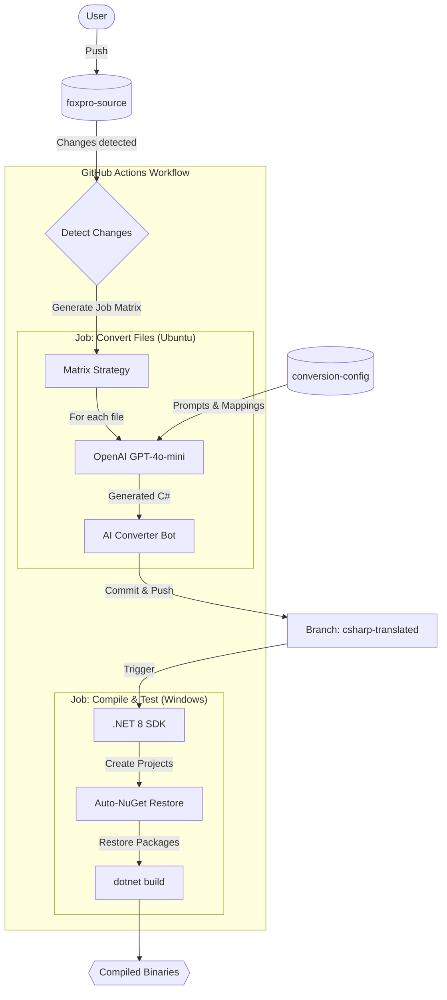

# FoxPro to C# Conversion Pipeline

This repository hosts an automated GitOps pipeline designed to convert legacy Visual FoxPro (`.prg`, `.scx`, `.frx`) applications into modern C# .NET 8 solutions.

## Overview

The system leverages OpenAI's GPT-4o-mini to intelligently translate FoxPro code into maintainable C# code, organized by architectural layers (Forms, Reports, Core logic). The entire process is orchestrated via GitHub Actions.

## Architecture

The workflow moves from source changes to a compiled .NET solution through a series of automated stages.

## Project Structure

- **`foxpro-source/`**: Place your legacy Visual FoxPro files here (`.prg`, `.scx`, etc.).
- **`conversion-config/`**:
  - `ai-prompts.json`: System and user prompts for the LLM, tailored by file type.
  - `file-mappings.json`: Maps FoxPro extensions to C# targets and directory structures.
- **`csharp-translated/`**: (Auto-generated) Contains the converted C# code. This is populated by the AI Converter Bot.

## Workflow Description

1.  **Detect Changes**: The pipeline scans `foxpro-source/` for modified .vb files (mapped extensions).
2.  **Convert Files**:
    - Runs in parallel for modified files.
    - Uses `ai-prompts.json` to guide the translation (e.g., "Modules to Class Libraries", "Forms to WinForms").
    - Results are committed to the `csharp-translated` orphan branch.
3.  **Compile & Test**:
    - Runs on a self-hosted Windows runner.
    - Scaffolds a new .NET Solution (`BankingSystem.sln`).
    - Smartly adds NuGet packages (Entity Framework, ASP.NET Core, Logging) based on code analysis.
    - Builds the solution to verify compilation.

## Setup & Usage

1.  **Configure Secrets**: Ensure `OPENAI_API_KEY` is set in the repository secrets.
2.  **Mapping Config**: Edit `conversion-config/directory_mappings` in `file-mappings.json` to control where generated files are placed (e.g., `Banking.Core`, `Banking.Data`).
3.  **Run**: Simply push changes to the `main` branch to trigger the pipeline.
